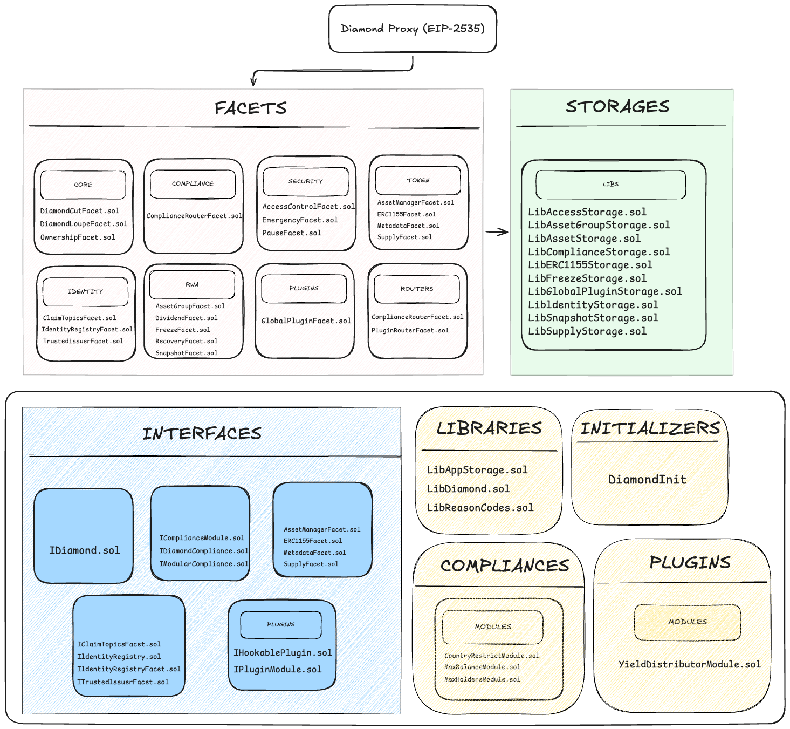
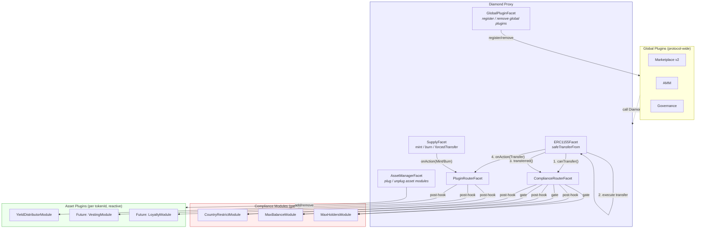
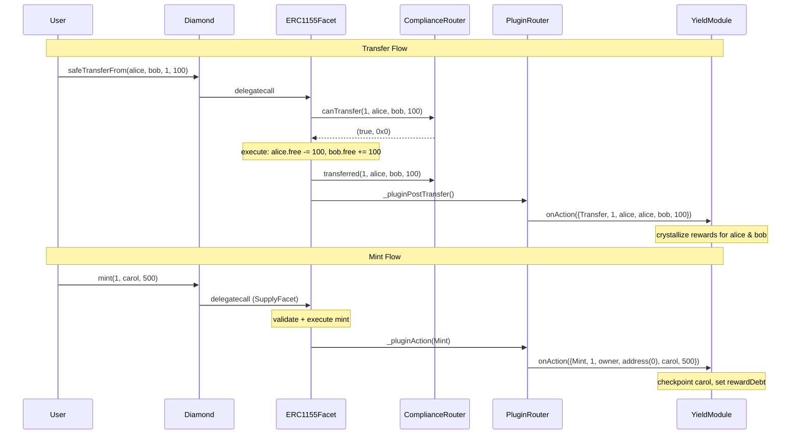

# Diamond ERC-3643

ERC-3643 security tokens for Real World Assets, built on the EIP-2535 Diamond Proxy with ERC-1155 multi-token support.

A single Diamond contract manages multiple regulated asset classes — each `tokenId` carries its own compliance rules, identity requirements, and supply controls. Designed for debt securities, fractional real estate, tokenized commodities, and any RWA that requires on-chain KYC/AML enforcement.

## Architecture



### Standards

| Standard | Role |
|----------|------|
| **ERC-3643 (T-REX)** | On-chain compliance: KYC/AML identity, jurisdiction restrictions, freeze, recovery |
| **EIP-2535 Diamond** | Modular upgradeability via facets; bypasses the 24 KB contract size limit |
| **ERC-1155 Multi-Token** | Multiple asset classes (`tokenId` = asset class) in a single contract |

### Three-Level Regulatory Model

```
Global              ──  Diamond ownership, global pause, RBAC, identity registry
  └─ Per tokenId    ──  compliance module, identity profile, supply cap, allowed countries
       └─ Per holder ── balance partitions (free/locked/custody), freeze, lockup
```

## Facets (21 total)

### Core (3)

| Facet | Purpose |
|-------|---------|
| `DiamondCutFacet` | Add, replace, or remove facets |
| `DiamondLoupeFacet` | Introspection + ERC-165 support |
| `OwnershipFacet` | Ownable2Step ownership transfer |

### Security (3)

| Facet | Purpose |
|-------|---------|
| `AccessControlFacet` | Role-based access control (ISSUER, COMPLIANCE_ADMIN, TRANSFER_AGENT) |
| `PauseFacet` | Global pause + per-asset pause |
| `EmergencyFacet` | Circuit breaker for emergency shutdown |

### Token — ERC-1155 (4)

| Facet | Purpose |
|-------|---------|
| `AssetManagerFacet` | Register and configure asset classes per `tokenId`; plug/unplug compliance and plugin modules |
| `ERC1155Facet` | Compliant transfers and balance queries |
| `SupplyFacet` | Mint, burn, forced transfer |
| `MetadataFacet` | Name, symbol, URI per `tokenId` |

### Identity — KYC/AML (3)

| Facet | Purpose |
|-------|---------|
| `IdentityRegistryFacet` | Bind wallets to ONCHAINID + country code |
| `ClaimTopicsFacet` | Define required KYC claim topics per identity profile |
| `TrustedIssuerFacet` | Manage authorized claim issuers |

### RWA Operations (5)

| Facet | Purpose |
|-------|---------|
| `AssetGroupFacet` | Hierarchical asset groups with lazy minting (e.g., building → apartments) |
| `FreezeFacet` | Freeze wallets globally, per asset, or partial amounts; lockup with expiry |
| `RecoveryFacet` | Wallet recovery and balance migration |
| `SnapshotFacet` | Point-in-time balance snapshots |
| `DividendFacet` | Pro-rata dividend distribution linked to snapshots |

### Routers & Plugins (3)

| Facet | Purpose |
|-------|---------|
| `ComplianceRouterFacet` | Route `canTransfer()` + post-hooks to compliance modules per `tokenId` |
| `PluginRouterFacet` | Route `onAction()` to hookable plugin modules per `tokenId` after balance mutations |
| `GlobalPluginFacet` | Registry for protocol-wide plugins (marketplace, AMM, governance) — cross-asset services |

### Compliance Modules (pluggable, gating)

| Module | Description |
|--------|-------------|
| `CountryRestrictModule` | ISO-3166 country-based transfer restrictions |
| `MaxBalanceModule` | Maximum token balance per holder |
| `MaxHoldersModule` | Cap on number of unique holders per asset |

### Plugin Modules (pluggable, reactive)

| Module | Description |
|--------|-------------|
| `YieldDistributorModule` | Distributes real yield (ERC-20, ERC-1155 internal or external) to holders proportionally via accumulator pattern (O(1) per operation) |

## Transfer Flow

Every `safeTransferFrom` passes through 6 validation stages, then fires compliance and plugin hooks:

```
safeTransferFrom(from, to, tokenId, amount)
  │
  ├─ 1. Protocol paused?           → revert ProtocolPaused
  ├─ 2. Wallet frozen (global)?    → revert WalletFrozenGlobal
  ├─ 3. Asset registered & active? → revert AssetNotRegistered / AssetPaused
  ├─ 4. Wallet frozen (asset)?     → revert WalletFrozenAsset / LockupActive
  ├─ 5. Sufficient free balance?   → revert InsufficientFreeBalance
  ├─ 6. Compliance module check    → revert ComplianceCheckFailed
  │
  ├─ Execute: update balances + holder tracking
  ├─ Compliance post-hook: module.transferred() for state updates
  ├─ Plugin post-hook: module.onAction() for reactive logic (yield, loyalty, etc.)
  └─ ERC-1155 receiver callback: onERC1155Received()
```

## Plugin System (Plug & Play)

The Diamond protocol has three extension mechanisms:

1. **Compliance Modules** — gate transfers before execution (per tokenId)
2. **Asset Plugins** — react to state changes after execution (per tokenId)
3. **Global Plugins** — protocol-wide services that operate across all tokenIds

All are pluggable at runtime — no `diamondCut` required.

### Why Plugins Instead of Facets?

Adding a facet via `diamondCut` costs ~20k gas per selector (5 selectors = ~100k gas) and requires owner privileges. Plugins cost a single `SSTORE` (~20k gas total) to register. They're also safer — plugins are external contracts with their own storage, they can't corrupt the Diamond's internal state.

| Dimension | Compliance Modules | Asset Plugins | Global Plugins |
|-----------|-------------------|---------------|----------------|
| **Scope** | Per tokenId | Per tokenId | Protocol-wide |
| **Interface** | `IComplianceModule` | `IHookablePlugin` | `IPluginModule` |
| **Purpose** | **Gate** — block invalid transfers | **React** — observe balance changes | **Service** — cross-asset functionality |
| **When** | Before balance mutation | After balance mutation | On demand |
| **Receives hooks?** | Yes (`canTransfer`, `transferred`) | Yes (`onAction`) | No |
| **Example** | Country restriction, max balance | Yield, vesting, loyalty | Marketplace, AMM, governance |
| **Max count** | 10 per tokenId | 5 per tokenId | 20 protocol-wide |
| **Managed by** | `AssetManagerFacet` | `AssetManagerFacet` | `GlobalPluginFacet` |

### Plugin Architecture

```
Diamond
│
├── Global Plugins (GlobalPluginFacet)
│   ├── Protocol-wide, cross-asset services
│   ├── Marketplace, AMM, governance, voting
│   ├── register / remove / activate / deactivate
│   ├── O(1) add/remove via indexed mapping
│   └── Versionable: remove v1, add v2
│
└── Asset Plugins (per tokenId, in AssetConfig)
    ├── Hookable (IHookablePlugin)
    │   └── Receive onAction on transfer/mint/burn
    │       Ex: YieldDistributor, vesting, loyalty
    └── Service (IPluginModule)
        └── Registered but not hooked
```

### Plugin Interfaces

All plugins implement `IPluginModule` (base):

```solidity
interface IPluginModule {
    function name() external view returns (string memory);
}
```

Plugins that need balance-change hooks implement `IHookablePlugin`:

```solidity
interface IHookablePlugin is IPluginModule {
    enum ActionType { Transfer, Mint, Burn }

    struct ActionParams {
        ActionType actionType;   // what happened
        uint256    tokenId;      // which asset class
        address    operator;     // who initiated (msg.sender in Diamond)
        address    from;         // source (address(0) for mints)
        address    to;           // destination (address(0) for burns)
        uint256    amount;       // how many tokens
    }

    function onAction(ActionParams calldata params) external;
}
```

**Design decisions:**

- **Single `onAction` instead of `onTransfer`/`onMint`/`onBurn`** — the module decides which action types to handle. A yield module needs all three; a tax module only needs transfers. No wasted gas on empty hook calls.
- **`ActionType` enum instead of checking `from == address(0)`** — explicit, extensible (can add `Freeze`, `Recovery` in the future without breaking the interface), cheaper to compare (uint8 vs address).
- **Calldata struct instead of 5 separate parameters** — avoids stack-too-deep, cheaper ABI encoding, cleaner function signatures.
- **`operator` field** — distinguishes who initiated the action from the `from`/`to` addresses. A `forcedTransfer` has `operator = admin`, `from = holder`.

### Global Plugins — Cross-Asset Services

Global plugins are protocol-wide services like marketplaces, AMMs, or governance modules. They operate across all tokenIds and are managed via `GlobalPluginFacet`.

```solidity
// Register a marketplace plugin
GlobalPluginFacet(diamond).registerGlobalPlugin(address(marketplaceV1));

// Version upgrade: remove v1, add v2
GlobalPluginFacet(diamond).removeGlobalPlugin(address(marketplaceV1));
GlobalPluginFacet(diamond).registerGlobalPlugin(address(marketplaceV2));

// Temporarily disable during incident
GlobalPluginFacet(diamond).setGlobalPluginStatus(address(marketplace), false);

// Re-enable
GlobalPluginFacet(diamond).setGlobalPluginStatus(address(marketplace), true);

// Query
GlobalPluginInfo[] memory all = GlobalPluginFacet(diamond).getGlobalPlugins();
address[] memory active = GlobalPluginFacet(diamond).getActiveGlobalPlugins();
bool registered = GlobalPluginFacet(diamond).isGlobalPlugin(address(marketplace));
```

Global plugins inherit the Diamond's role-based permission system — they interact with the Diamond's public API (`balanceOf`, `safeTransferFrom`, `isVerified`, etc.) like any other external contract, but are **recognized by the protocol** as authorized extensions.

**Storage design:** Uses an indexed mapping (`pluginIndex`) for O(1) add/remove/lookup instead of O(n) array scans. The `GlobalPluginInfo` struct packs `address` + `uint64` + `bool` into a single storage slot.

### Asset Plugins — Per-TokenId Modules

Asset plugins are tied to a specific tokenId. Hookable plugins receive automatic callbacks on every balance change.

```solidity
// Plug a hookable module into tokenId 1
AssetManagerFacet(diamond).addPluginModule(1, address(yieldModule));

// Unplug it
AssetManagerFacet(diamond).removePluginModule(1, address(yieldModule));

// Replace all modules at once
AssetManagerFacet(diamond).setPluginModules(1, [addr1, addr2]);

// Query active modules
address[] memory modules = AssetManagerFacet(diamond).getPluginModules(1);
```

Max 5 plugin modules per tokenId to bound gas costs on hooks.

### How Hooks Flow Through the System



### Hook Dispatch — Sequence Diagram



### Creating a Custom Plugin

#### Hookable Plugin (reacts to balance changes)

```solidity
import {IHookablePlugin} from "../interfaces/plugins/IHookablePlugin.sol";

contract TransferTaxPlugin is IHookablePlugin {
    address public immutable DIAMOND;

    constructor(address diamond_) { DIAMOND = diamond_; }

    function onAction(ActionParams calldata params) external {
        if (msg.sender != DIAMOND) revert("only diamond");
        if (params.actionType != ActionType.Transfer) return;
        _collectTax(params.tokenId, params.from, params.amount);
    }

    function name() external pure returns (string memory) { return "TransferTax"; }
}
```

Then plug it into a tokenId:

```solidity
AssetManagerFacet(diamond).addPluginModule(tokenId, address(taxPlugin));
```

#### Global Plugin (cross-asset service)

```solidity
import {IPluginModule} from "../interfaces/plugins/IPluginModule.sol";

contract MarketplacePlugin is IPluginModule {
    address public immutable DIAMOND;

    constructor(address diamond_) { DIAMOND = diamond_; }

    function name() external pure returns (string memory) { return "Marketplace v1"; }

    // Marketplace-specific functions — interacts with Diamond via public API
    function listToken(uint256 tokenId, uint256 amount, uint256 price) external { ... }
    function buyToken(uint256 listingId) external { ... }
}
```

Then register it protocol-wide:

```solidity
GlobalPluginFacet(diamond).registerGlobalPlugin(address(marketplace));
```

### GlobalPluginFacet — API Reference

#### State-Changing Functions (owner or COMPLIANCE_ADMIN)

| Function | Description |
|----------|-------------|
| `registerGlobalPlugin(plugin)` | Register a global plugin. Validates `IPluginModule.name()` on registration. Max 20. |
| `removeGlobalPlugin(plugin)` | Remove a global plugin. O(1) via swap-and-pop with indexed mapping. |
| `setGlobalPluginStatus(plugin, active)` | Activate/deactivate without removing. Useful for incidents or upgrades. |

#### View Functions

| Function | Description |
|----------|-------------|
| `getGlobalPlugins()` | Returns all registered plugins (active and inactive) with metadata. |
| `getActiveGlobalPlugins()` | Returns only active plugin addresses. |
| `getGlobalPluginInfo(plugin)` | Returns plugin address, registration timestamp, and active status. |
| `isGlobalPlugin(plugin)` | Returns true if the plugin is registered. |
| `globalPluginCount()` | Returns the total number of registered plugins. |

#### Events

| Event | When |
|-------|------|
| `GlobalPluginRegistered(plugin, name)` | A global plugin is registered |
| `GlobalPluginRemoved(plugin)` | A global plugin is removed |
| `GlobalPluginStatusChanged(plugin, active)` | A plugin is activated or deactivated |

#### Errors

| Error | When |
|-------|------|
| `GlobalPluginFacet__Unauthorized()` | Caller is not owner or COMPLIANCE_ADMIN |
| `GlobalPluginFacet__ZeroAddress()` | Plugin address is `address(0)` |
| `GlobalPluginFacet__AlreadyRegistered(plugin)` | Plugin is already registered |
| `GlobalPluginFacet__NotRegistered(plugin)` | Plugin is not registered |
| `GlobalPluginFacet__TooManyPlugins(count, max)` | Exceeds 20 global plugins |
| `GlobalPluginFacet__AlreadyActive(plugin)` | Setting active on already active plugin |
| `GlobalPluginFacet__AlreadyInactive(plugin)` | Setting inactive on already inactive plugin |

---

## Asset Groups & Lazy Minting

The `AssetGroupFacet` enables hierarchical tokenization — a parent asset (e.g., a building) can have child assets (e.g., individual apartments) that are only minted on-chain when sold:

```
createGroup(parentTokenId: 1, name: "Aurora Apartments", maxUnits: 100)
  → groupId: 1                                              ~215k gas

mintUnit(groupId: 1, investor: Alice, fractions: 500)
  → childTokenId: (1 << 128) | 1  →  "Apt 101"            ~600k gas
  → inherits parent's compliance, identity profile, issuer, countries
```

Child tokens that haven't been sold don't exist on-chain — zero gas cost until minted.

## Storage

12 isolated storage namespaces prevent slot collisions during upgrades:

| Library | Domain |
|---------|--------|
| `LibAppStorage` | Owner, pending owner, global pause, protocol version |
| `LibAssetStorage` | Asset configs per `tokenId` (name, symbol, supply cap, compliance module, plugin modules) |
| `LibERC1155Storage` | Balance partitions (free/locked/custody/pending), operator approvals |
| `LibSupplyStorage` | Total supply, holder count, holder tracking per `tokenId` |
| `LibFreezeStorage` | Global freeze, asset freeze, frozen amounts, lockup expiry |
| `LibAccessStorage` | Role mappings and role admin configuration |
| `LibIdentityStorage` | Wallet-to-identity bindings, identity profiles, verification cache |
| `LibComplianceStorage` | Token-to-module mappings, registered modules |
| `LibSnapshotStorage` | Snapshot data with balance captures |
| `LibDividendStorage` | Dividend records with claim tracking |
| `LibAssetGroupStorage` | Group configs, parent-child relationships |
| `LibGlobalPluginStorage` | Global plugin registry, indexed mapping, plugin metadata |

Each slot is derived from `keccak256("diamond.rwa.<domain>.storage") - 1`.

## Project Structure

```
diamond-erc3643/
├── packages/
│   ├── contracts/                    # Solidity (Foundry)
│   │   ├── src/
│   │   │   ├── Diamond.sol           # EIP-2535 proxy
│   │   │   ├── facets/               # 21 facets by domain
│   │   │   │   ├── core/
│   │   │   │   ├── token/
│   │   │   │   ├── identity/
│   │   │   │   ├── compliance/
│   │   │   │   ├── plugins/          # GlobalPluginFacet
│   │   │   │   ├── routers/          # PluginRouterFacet
│   │   │   │   ├── rwa/
│   │   │   │   └── security/
│   │   │   ├── compliance/modules/   # Pluggable compliance modules (gating)
│   │   │   ├── plugins/modules/      # Pluggable plugin modules (reactive)
│   │   │   │   └── YieldDistributorModule/
│   │   │   │       ├── YieldDistributorModule.sol
│   │   │   │       ├── README.md     # Full docs with examples
│   │   │   │       └── diagrams/     # Architecture & flow diagrams (PNG)
│   │   │   ├── interfaces/
│   │   │   │   ├── plugins/          # IPluginModule, IHookablePlugin
│   │   │   │   └── ...               # Domain-organized interfaces
│   │   │   ├── libraries/            # LibDiamond, LibAppStorage, LibReasonCodes
│   │   │   ├── storage/              # 12 namespaced storage libraries
│   │   │   └── initializers/         # DiamondInit
│   │   ├── test/
│   │   │   ├── unit/                 # 28 test files (1:1 with facets + modules)
│   │   │   │   ├── GlobalPluginFacet.t.sol
│   │   │   │   └── modules/plugins/  # YieldDistributorModule tests (58 tests)
│   │   │   ├── fuzz/                 # Property-based fuzz tests
│   │   │   ├── invariant/            # FREI-PI pattern invariant tests
│   │   │   ├── echidna/              # Echidna property-based fuzzing
│   │   │   └── helpers/              # DiamondHelper, MockComplianceModule, MockERC20, MockPluginModule
│   │   ├── script/                   # Deploy.s.sol, ConfigureAsset.s.sol
│   │   ├── foundry.toml
│   │   ├── remappings.txt
│   │   └── Makefile
│   ├── indexer/                      # Go blockchain event indexer
│   ├── app/                          # React 19 + Wagmi + RainbowKit frontend
│   └── tools/                        # Developer utilities
├── docs/
│   ├── architecture.md               # Detailed architecture specification
│   └── diagrams/                     # Mermaid diagrams (EN + PT)
│       ├── en/                       # 9 diagrams in English
│       ├── pt/                       # 9 diagrams in Portuguese
│       └── viewer.html               # Interactive diagram viewer
├── .github/workflows/ci.yml          # CI pipeline (7 parallel jobs)
├── turbo.json
├── pnpm-workspace.yaml
└── package.json
```

## Deployments

### Polygon Amoy Testnet (Chain ID: 80002)

| Contract | Address | Verified |
|----------|---------|----------|
| **Diamond (Proxy)** | [`0xAb07CEf1BEeDBb30F5795418c79879794b31C521`](https://amoy.polygonscan.com/address/0xAb07CEf1BEeDBb30F5795418c79879794b31C521) | ✅ |
| DiamondCutFacet | [`0x499b99F9516be8a363c7923e57d8dab2E63fC0D9`](https://amoy.polygonscan.com/address/0x499b99F9516be8a363c7923e57d8dab2E63fC0D9) | ✅ |
| DiamondLoupeFacet | [`0x92Da52B23380A68f4565cD3f5aECAb31FC56eff1`](https://amoy.polygonscan.com/address/0x92Da52B23380A68f4565cD3f5aECAb31FC56eff1) | ✅ |
| OwnershipFacet | [`0x97CBfcF2662c81fa93EcdC1A6e82045980061427`](https://amoy.polygonscan.com/address/0x97CBfcF2662c81fa93EcdC1A6e82045980061427) | ✅ |
| AccessControlFacet | [`0xD097fe5983a52e9e28a504375285e8Ca124C880B`](https://amoy.polygonscan.com/address/0xD097fe5983a52e9e28a504375285e8Ca124C880B) | ✅ |
| PauseFacet | [`0xEF310f4bD869e9711c45022B3A8Da074A003FF0C`](https://amoy.polygonscan.com/address/0xEF310f4bD869e9711c45022B3A8Da074A003FF0C) | ✅ |
| EmergencyFacet | [`0x67561FF38AF20f93E3e835B5F02D4545E30266C6`](https://amoy.polygonscan.com/address/0x67561FF38AF20f93E3e835B5F02D4545E30266C6) | ✅ |
| FreezeFacet | [`0xdfd98C7b28CCcaE14b48612c4239B36E78094F49`](https://amoy.polygonscan.com/address/0xdfd98C7b28CCcaE14b48612c4239B36E78094F49) | ✅ |
| RecoveryFacet | [`0xA1CBD518D0b4C7850099b2AA1a26889739c32B5a`](https://amoy.polygonscan.com/address/0xA1CBD518D0b4C7850099b2AA1a26889739c32B5a) | ✅ |
| AssetManagerFacet (v2) | [`0xBE58CB4e9d0dBbC21C4333ae513dc9aAe1Bc470a`](https://amoy.polygonscan.com/address/0xBE58CB4e9d0dBbC21C4333ae513dc9aAe1Bc470a) | ✅ |
| ClaimTopicsFacet | [`0xcE23BcDc538430aF96745968dBc874C1daB8C824`](https://amoy.polygonscan.com/address/0xcE23BcDc538430aF96745968dBc874C1daB8C824) | ✅ |
| TrustedIssuerFacet | [`0x578550bA4fAe186Cd7614862De3Ec8092F7Db5Db`](https://amoy.polygonscan.com/address/0x578550bA4fAe186Cd7614862De3Ec8092F7Db5Db) | ✅ |
| IdentityRegistryFacet | [`0x514f8C0c8b9C5Dd3BF78AAB95c162a32eA653522`](https://amoy.polygonscan.com/address/0x514f8C0c8b9C5Dd3BF78AAB95c162a32eA653522) | ✅ |
| ComplianceRouterFacet | [`0x09BCf4BafA1a4943024E6A8b9ffc55AC539EEb13`](https://amoy.polygonscan.com/address/0x09BCf4BafA1a4943024E6A8b9ffc55AC539EEb13) | ✅ |
| ERC1155Facet (v2) | [`0xc7a6D1561eAa0837907e49f9245332744d6B5204`](https://amoy.polygonscan.com/address/0xc7a6D1561eAa0837907e49f9245332744d6B5204) | ✅ |
| SupplyFacet (v2) | [`0x4F52cCd0F5941D2177d9ea98A5C0a35100d0e7E1`](https://amoy.polygonscan.com/address/0x4F52cCd0F5941D2177d9ea98A5C0a35100d0e7E1) | ✅ |
| MetadataFacet | [`0x7BeaC0bEA5687191c41Bb39E5C8c708a13f49Ad7`](https://amoy.polygonscan.com/address/0x7BeaC0bEA5687191c41Bb39E5C8c708a13f49Ad7) | ✅ |
| SnapshotFacet | [`0xd11381ea9b24b90b16671F04727B2D39793d4C76`](https://amoy.polygonscan.com/address/0xd11381ea9b24b90b16671F04727B2D39793d4C76) | ✅ |
| DividendFacet | [`0xD08d0D88CA607Bacc3945532158Ec8b52E397190`](https://amoy.polygonscan.com/address/0xD08d0D88CA607Bacc3945532158Ec8b52E397190) | ✅ |
| AssetGroupFacet | [`0xBF5753C300796f7D78227E0BD1f4A2FbAD3e9C9c`](https://amoy.polygonscan.com/address/0xBF5753C300796f7D78227E0BD1f4A2FbAD3e9C9c) | ✅ |
| DiamondInit | [`0x663217FCFC5807636b1201b413921Ab01b1C6Be0`](https://amoy.polygonscan.com/address/0x663217FCFC5807636b1201b413921Ab01b1C6Be0) | ✅ |
| DiamondABI (EIP-1967 v2) | [`0xf164d030005Db7845ed756D69f17470868d69E5b`](https://amoy.polygonscan.com/address/0xf164d030005db7845ed756d69f17470868d69e5b) | ✅ |
| CountryRestrictModule | [`0x0c15e06c36b07E44aEe6D49a75554bc7bfFa50D2`](https://amoy.polygonscan.com/address/0x0c15e06c36b07E44aEe6D49a75554bc7bfFa50D2) | ✅ |
| MaxBalanceModule | [`0x4B3cCd1F7BB1aF5F41b73e7fE3010023FcD89B44`](https://amoy.polygonscan.com/address/0x4B3cCd1F7BB1aF5F41b73e7fE3010023FcD89B44) | ✅ |
| MaxHoldersModule | [`0xC40Bf7bb339DD4485b1F5c3c0C5FE78DACD9999a`](https://amoy.polygonscan.com/address/0xC40Bf7bb339DD4485b1F5c3c0C5FE78DACD9999a) | ✅ |
| GlobalPluginFacet | [`0x7C01A56f048b196D14EbcE1454b816930B6dF826`](https://amoy.polygonscan.com/address/0x7C01A56f048b196D14EbcE1454b816930B6dF826) | ✅ |
| PluginRouterFacet | [`0xB4558240336b0971199774b597D2A6Be5CbEF0D9`](https://amoy.polygonscan.com/address/0xB4558240336b0971199774b597D2A6Be5CbEF0D9) | ✅ |
| YieldDistributorModule | [`0xa8c6A9AAfd18545bEe6BC734eba702C55beA95dF`](https://amoy.polygonscan.com/address/0xa8c6a9aafd18545bee6bc734eba702c55bea95df) | ✅ |

> **Owner:** `0xB40061C7bf8394eb130Fcb5EA06868064593BFAa`
>
> The Diamond proxy exposes **143 functions** (73 read + 70 write) through the DiamondABI stub — this is expected for an EIP-2535 Diamond with 21 facets. Each function lives in its own facet; the DiamondABI is a zero-logic contract that only provides the combined ABI for Polygonscan's "Read/Write as Proxy" interface.
>
> Full deployment data: [`packages/contracts/deployments/amoy.json`](packages/contracts/deployments/amoy.json)

## Getting Started

### Prerequisites

- [Foundry](https://book.getfoundry.sh/getting-started/installation) (forge, cast, anvil)
- [Node.js](https://nodejs.org/) >= 20
- [pnpm](https://pnpm.io/) >= 10

### Install

```bash
git clone git@github.com:renancorreadev/diamond-erc3643.git
cd diamond-erc3643
pnpm install
cd packages/contracts
forge install
```

### Build

```bash
make build           # forge build --sizes
```

### Test

```bash
make test            # all tests
make test-unit       # unit tests only
make test-fuzz       # fuzz tests (10,000 runs)
make test-invariant  # invariant tests (10,000 runs)
make test-contract CONTRACT=ERC1155Facet   # single contract
```

### Security Testing

```bash
make slither         # static analysis
make echidna         # property-based fuzzing (50,000 calls)
make coverage        # forge coverage → lcov.info
make lint            # solhint
```

### Deploy (Local)

```bash
# Terminal 1
anvil

# Terminal 2
make deploy-local
```

### Deploy (Testnet)

```bash
# Import deployer key (interactive, never in plaintext)
cast wallet import deployer --interactive

# Deploy
forge script script/Deploy.s.sol \
  --rpc-url $AMOY_RPC_URL \
  --account deployer \
  --broadcast \
  --verify \
  --etherscan-api-key $POLYGONSCAN_API_KEY
```

## CI/CD

The CI pipeline runs 7 parallel jobs on every PR:

| Job | What it does |
|-----|-------------|
| **Lint** | `solhint src/**/*.sol` |
| **Build** | `forge build --sizes` (checks 24 KB limit) |
| **Test** | `forge test -vvv` |
| **Fuzz** | 10,000 fuzz runs on `test/fuzz/**` |
| **Invariant** | 10,000 invariant runs on `test/invariant/**` |
| **Slither** | Static analysis with Slither |
| **Echidna** | Property-based fuzzing (50,000 calls) |
| **Coverage** | `forge coverage` → Codecov |

## Roles & Permissions

| Role | Capabilities |
|------|-------------|
| **Owner** | `diamondCut`, `transferOwnership`, `emergencyPause`, `setRoleAdmin` |
| **COMPLIANCE_ADMIN** | `registerAsset`, `createGroup`, `setComplianceModules`, `addComplianceModule`, `removeComplianceModule`, `addPluginModule`, `removePluginModule`, `registerGlobalPlugin`, `removeGlobalPlugin`, `setGlobalPluginStatus`, `setIdentityProfile`, `registerIdentity` |
| **ISSUER_ROLE** | `mint`, `burn`, `mintUnit`, `mintUnitBatch`, `createDividend` |
| **TRANSFER_AGENT** | `forcedTransfer`, `recoverWallet` |
| **Token Holder** | `safeTransferFrom` (if compliance passes), `claimDividend`, `claimYield`, `claimAllYield`, `setApprovalForAll` |

## Documentation

- **[Architecture Spec](docs/architecture.md)** — design principles, regulatory model, facet map, storage layout, transfer validation pipeline, compliance modules, reason codes, roles, events
- **[Diagrams](docs/diagrams/)** — 9 Mermaid diagrams covering the full system, available in [English](docs/diagrams/en/) and [Portuguese](docs/diagrams/pt/); open `docs/diagrams/viewer.html` for an interactive viewer

### Diagram Index

| # | Diagram |
|---|---------|
| 01 | High-Level Architecture — Diamond proxy + 21 facets + 12 storage slots |
| 02 | Regulated Transfer Flow — 6 validation stages with revert paths |
| 03 | Asset Groups & Lazy Minting — `createGroup` → `mintUnit` with gas costs |
| 04 | Storage Layout — 12 namespaced slots with all fields |
| 05 | Roles & Permissions — RBAC tree with all operations |
| 06 | Compliance Pipeline — Sequence diagram of full transfer validation |
| 07 | Full Technology Stack — Frontend → Indexer → Blockchain |
| 08 | Token Lifecycle — State machine: register → mint → freeze → snapshot → dividend |
| 09 | Real Estate Example — End-to-end building tokenization with rent distribution |
| 10 | Plugin System — Compliance (gating) vs Asset Plugins (reactive) vs Global Plugins (services) |
| 11 | Plugin Hook Flow — Sequence diagram of onAction dispatch |
| 12 | YieldDistributor — Accumulator pattern with O(1) distribution |

## Tech Stack

| Layer | Technology |
|-------|-----------|
| Smart Contracts | Solidity 0.8.28, Foundry, OpenZeppelin |
| Proxy Pattern | EIP-2535 Diamond (Nick Mudge reference) |
| Token Standard | ERC-1155 with ERC-3643 compliance hooks |
| Identity | ONCHAINID (ERC-734 keys + ERC-735 claims) |
| Testing | Forge (unit + fuzz + invariant), Echidna, Slither |
| Indexer | Go + RocksDB + GraphQL |
| CI/CD | GitHub Actions, Codecov, Changesets |
| Monorepo | pnpm workspaces + Turborepo |

## References

- [ERC-3643 (T-REX)](https://github.com/ERC-3643/ERC-3643) — Security Token Standard
- [EIP-2535 Diamond Standard](https://eips.ethereum.org/EIPS/eip-2535) — Multi-Facet Proxy
- [Nick Mudge Diamond Reference](https://github.com/mudgen/diamond-3-hardhat)
- [Trail of Bits: Building Secure Contracts](https://github.com/crytic/building-secure-contracts)
- [ONCHAINID](https://github.com/onchain-id/solidity) — On-Chain Identity

## License

MIT
