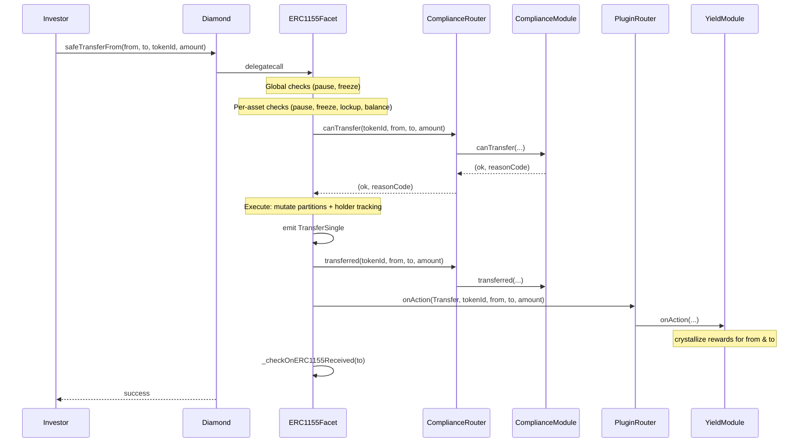

# Architecture: Diamond ERC-3643 Multi-Asset RWA Protocol

## 1. Design Principles

| Principle | Decision |
|-----------|----------|
| Diamond is a shell | No business logic in `Diamond.sol` — only routing |
| Regulatory model per `tokenId` | Each asset carries its own identity profile + compliance modules |
| Profile-based identity | Multiple `tokenId`s can share one regulatory profile (reduces deployment cost) |
| Compliance router | Each `tokenId` points to modules; modules are pluggable and upgradeable |
| Plugin system | External modules hook into balance mutations without `diamondCut` — zero storage collision risk |
| Storage namespaced | One `LibXxxStorage` per domain — 12 isolated namespaces |
| Batch-optimized | Global identity checks done once before per-asset loop |
| Reason codes | Compliance returns `bytes32` codes, not booleans |
| Observability | Rich events for every state change — indexer-friendly |
| Multi-asset rewards | YieldDistributor supports ERC-20 + ERC-1155 (internal cross-tokenId and external) |

---

## 2. Three-Level Regulatory Model

```
┌─────────────────────────────────────────────────────────────────┐
│  LEVEL 1 — GLOBAL                                               │
│  (shared across all tokenIds)                                   │
│                                                                 │
│  • Diamond ownership / governance                               │
│  • Global pause + emergency pause                               │
│  • Access control roles (8 roles)                               │
│  • Identity registry  (wallet → ONCHAINID + country)            │
│  • Trusted issuers (per profile)                                │
│  • Global plugins (cross-asset services)                        │
└─────────────────────────────────────────────────────────────────┘
            │
            ▼
┌─────────────────────────────────────────────────────────────────┐
│  LEVEL 2 — PER tokenId (Asset Config)                          │
│                                                                 │
│  • Identity profile ID  →  which claim topics are required      │
│  • Compliance modules   →  country rules, max holders, max bal  │
│  • Plugin modules       →  yield, vesting, loyalty (reactive)   │
│  • Supply cap / current supply                                  │
│  • Asset-level pause / freeze                                   │
│  • Metadata (name, symbol, URI)                                 │
│  • Authorized issuer (who can mint this asset)                  │
│  • Allowed jurisdictions (country whitelist)                    │
│  • Asset groups (parent/child hierarchy)                        │
└─────────────────────────────────────────────────────────────────┘
            │
            ▼
┌─────────────────────────────────────────────────────────────────┐
│  LEVEL 3 — PER holder + tokenId                                │
│                                                                 │
│  • Balance partitions (free / locked / custody / pending)       │
│  • Per-asset freeze (binary)                                    │
│  • Partial freeze amount (frozen tokens within balance)         │
│  • Lockup / vesting expiry                                      │
│  • Yield accumulator (rewardDebt + pendingRewards)              │
└─────────────────────────────────────────────────────────────────┘
```

---

## 3. Facet Map (21 facets)

```
Diamond (proxy shell — fallback → delegatecall)
│
├── CORE (3)
│   ├── DiamondCutFacet         — add/replace/remove facets
│   ├── DiamondLoupeFacet       — EIP-2535 introspection + IERC165
│   └── OwnershipFacet          — Ownable2Step
│
├── SECURITY (3)
│   ├── AccessControlFacet      — 8 roles: GOVERNANCE, UPGRADER, PAUSER, ISSUER,
│   │                             COMPLIANCE_ADMIN, TRANSFER_AGENT, RECOVERY_AGENT, CLAIM_ISSUER
│   ├── PauseFacet              — global pause + per-tokenId pause
│   └── EmergencyFacet          — circuit breaker
│
├── TOKEN (4)
│   ├── ERC1155Facet            — safeTransferFrom, safeBatchTransferFrom,
│   │                             balanceOf, balanceOfBatch, setApprovalForAll,
│   │                             partitionBalanceOf + compliance hooks + plugin hooks
│   │                             + receiver callbacks (onERC1155Received)
│   ├── AssetManagerFacet       — registerAsset, compliance modules, plugin modules config
│   ├── SupplyFacet             — mint, batchMint, burn, forcedTransfer + plugin hooks
│   └── MetadataFacet           — name(), symbol(), uri() per tokenId, tokenInfo()
│
├── IDENTITY (3)
│   ├── IdentityRegistryFacet   — registerIdentity, isVerified(wallet, profileId), batch ops
│   ├── TrustedIssuerFacet      — addTrustedIssuer, removeTrustedIssuer per profileId
│   └── ClaimTopicsFacet        — createProfile, setProfileClaimTopics
│
├── ROUTERS & PLUGINS (3)
│   ├── ComplianceRouterFacet   — canTransfer() + post-hooks → compliance modules per tokenId
│   ├── PluginRouterFacet       — onAction() → hookable plugin modules per tokenId
│   └── GlobalPluginFacet       — register/remove/activate/deactivate protocol-wide plugins
│
└── RWA OPERATIONS (5)
    ├── FreezeFacet             — global/asset/partial freeze, lockup with expiry
    ├── RecoveryFacet           — wallet recovery, migrate all token balances
    ├── SnapshotFacet           — point-in-time balance snapshots per tokenId
    ├── DividendFacet           — pro-rata dividend distribution linked to snapshots
    └── AssetGroupFacet         — hierarchical groups (parent/child), lazy mint units
```

### External Modules (not facets — standalone contracts)

```
Compliance Modules (gating — block invalid transfers)
├── CountryRestrictModule       — ISO-3166 country-based restrictions
├── MaxBalanceModule            — maximum balance per holder
└── MaxHoldersModule            — cap on unique holders per asset

Plugin Modules (reactive — observe balance changes)
└── YieldDistributorModule      — proportional yield distribution (ERC-20 + ERC-1155)
                                  Synthetix/MasterChef accumulator, O(1) per operation
```

---

## 4. Storage Layout (12 Namespaced Libraries)

```solidity
// Each lib uses a unique slot:
// slot = keccak256("diamond.rwa.<domain>.storage") - 1

LibDiamondStorage       // facet routing, owner, supportedInterfaces — EIP-2535 standard
LibAppStorage           // contractName, contractSymbol, protocolPaused, emergencyPaused
LibAccessStorage        // roles mapping, role admins
LibERC1155Storage       // balance partitions, operator approvals
LibAssetStorage         // AssetConfig per tokenId, registered tokenIds, plugin modules
LibIdentityStorage      // wallet→identity+country, profiles, trusted issuers, verification cache
LibComplianceStorage    // tokenId→module mappings, module registry
LibFreezeStorage        // global/asset freeze flags, frozen amounts, lockup expiry
LibSupplyStorage        // totalSupply, holderCount, holder tracking per tokenId
LibSnapshotStorage      // snapshot data with balance captures
LibDividendStorage      // dividend records with claim tracking
LibAssetGroupStorage    // group configs, parent-child relationships
LibGlobalPluginStorage  // global plugin registry, indexed mapping, plugin metadata
```

### LibAssetStorage layout

```solidity
struct AssetConfig {
    string  name;
    string  symbol;
    string  uri;
    uint256 supplyCap;            // 0 = unlimited
    uint32  identityProfileId;    // → LibIdentityStorage.profiles[id]
    address[] complianceModules;  // → IComplianceModule[] (max 10)
    address[] pluginModules;      // → IHookablePlugin[] (max 5)
    address issuer;               // who can mint
    bool    paused;
    bool    exists;
    uint16[] allowedCountries;    // ISO 3166-1 numeric
}

struct AssetStorage {
    mapping(uint256 => AssetConfig) configs;   // tokenId → config
    uint256[] registeredTokenIds;
    uint256 nextTokenId;                       // auto-increment
}
```

### LibIdentityStorage layout

```solidity
struct IdentityProfile {
    uint256[] requiredClaimTopics;
    mapping(address => bool) trustedIssuers;
    uint64 version;   // incremented on any change → invalidates cache
}

struct IdentityStorage {
    mapping(address => address)  walletToIdentity;    // wallet → ONCHAINID
    mapping(address => uint16)   walletCountry;
    mapping(address => uint64)   identityVersion;     // per wallet
    mapping(uint32 => IdentityProfile) profiles;      // profileId → policy
    mapping(address => mapping(uint32 => bool)) verifiedCache;   // wallet+profile → status
    mapping(address => mapping(uint32 => uint64)) cacheVersion;  // invalidation
}
```

### LibERC1155Storage layout

```solidity
struct PartitionBalance {
    uint256 free;
    uint256 locked;
    uint256 custody;
    uint256 pendingSettlement;
}

struct ERC1155Storage {
    // tokenId → holder → partition balances
    mapping(uint256 => mapping(address => PartitionBalance)) partitions;
    // operator approvals
    mapping(address => mapping(address => bool)) operatorApprovals;
}
```

### LibFreezeStorage layout

```solidity
struct FreezeStorage {
    mapping(address => bool)     globalFreeze;           // wallet frozen across all assets
    mapping(uint256 => mapping(address => bool))    assetFreeze;    // tokenId → wallet → frozen
    mapping(uint256 => mapping(address => uint256)) frozenAmount;   // partial freeze
    mapping(uint256 => mapping(address => uint64))  lockupExpiry;   // unix timestamp
}
```

### LibGlobalPluginStorage layout

```solidity
struct GlobalPluginInfo {
    address plugin;      // plugin contract address
    uint64 registeredAt; // block.timestamp (fits until year 2554)
    bool active;         // soft-disable without removing
}

struct GlobalPluginStorage {
    GlobalPluginInfo[] plugins;                    // ordered list
    mapping(address => uint256) pluginIndex;       // O(1) lookup (1-indexed)
}
```

### LibAssetGroupStorage layout

```solidity
struct AssetGroup {
    string name;
    uint256 parentTokenId;
    uint256 maxUnits;
    uint256 unitsMinted;
    bool exists;
}

struct AssetGroupStorage {
    mapping(uint256 => AssetGroup) groups;         // groupId → group
    mapping(uint256 => uint256[]) groupChildren;   // groupId → childTokenIds
    mapping(uint256 => uint256) childToGroup;      // childTokenId → groupId
    uint256[] registeredGroupIds;
}
```

---

## 5. Transfer Validation Flow

```
safeTransferFrom(from, to, tokenId, amount, data)
        │
        ▼
  1. Protocol paused?              → revert ProtocolPaused
  2. Emergency paused?             → revert EmergencyPaused
  3. Wallet frozen (global)?       → revert WalletFrozenGlobal
        │
        ▼  [PER tokenId]
  4. Asset registered & active?    → revert AssetNotRegistered / AssetPaused
  5. Wallet frozen (asset)?        → revert WalletFrozenAsset
  6. Lockup active?                → revert LockupActive
  7. Sufficient free balance?      → revert InsufficientFreeBalance
  8. Compliance module check       → revert ComplianceCheckFailed(reasonCode)
        │
        ▼
  Execute: update balances + holder tracking
        │
        ├─ emit TransferSingle(operator, from, to, tokenId, amount)
        ├─ Compliance post-hook: module.transferred()
        ├─ Plugin post-hook: module.onAction(Transfer, tokenId, from, to, amount)
        └─ ERC-1155 receiver callback: onERC1155Received() if to.code.length > 0
```

### Batch optimization

```
safeBatchTransferFrom([ids], [amounts])
        │
        ├─ Run steps 1–3 ONCE (global checks)
        └─ Loop over ids:
            └─ Run steps 4–8 per tokenId, then execute + hooks
```

---

## 6. Extension Mechanisms

The protocol has three pluggable extension types — all manageable at runtime without `diamondCut`:

| Dimension | Compliance Modules | Asset Plugins | Global Plugins |
|-----------|-------------------|---------------|----------------|
| **Scope** | Per tokenId | Per tokenId | Protocol-wide |
| **Interface** | `IComplianceModule` | `IHookablePlugin` | `IPluginModule` |
| **Purpose** | **Gate** — block invalid transfers | **React** — observe balance changes | **Service** — cross-asset functionality |
| **When** | Before balance mutation | After balance mutation | On demand |
| **Receives hooks?** | Yes (`canTransfer`, `transferred`) | Yes (`onAction`) | No |
| **Example** | Country restriction, max balance | Yield distributor, vesting | Marketplace, AMM, governance |
| **Max count** | 10 per tokenId | 5 per tokenId | 20 protocol-wide |
| **Managed by** | `AssetManagerFacet` | `AssetManagerFacet` | `GlobalPluginFacet` |

### Compliance Module Interface

```solidity
interface IComplianceModule {
    function canTransfer(
        uint256 tokenId,
        address from,
        address to,
        uint256 amount,
        bytes calldata data
    ) external view returns (bool ok, bytes32 reason);

    function transferred(uint256 tokenId, address from, address to, uint256 amount) external;
    function minted(uint256 tokenId, address to, uint256 amount) external;
    function burned(uint256 tokenId, address from, uint256 amount) external;
}
```

### Plugin Interface

```solidity
interface IPluginModule {
    function name() external view returns (string memory);
}

interface IHookablePlugin is IPluginModule {
    enum ActionType { Transfer, Mint, Burn }

    struct ActionParams {
        ActionType actionType;
        uint256    tokenId;
        address    operator;
        address    from;
        address    to;
        uint256    amount;
    }

    function onAction(ActionParams calldata params) external;
}
```

### Hook Dispatch Flow

```
Balance mutation (transfer/mint/burn)
        │
        ├─ 1. Compliance post-hooks
        │      ComplianceRouterFacet → each module in complianceModules[tokenId]
        │
        └─ 2. Plugin post-hooks
               PluginRouterFacet → each module in pluginModules[tokenId]
                                   calls onAction({type, tokenId, operator, from, to, amount})
```

### Reason Codes (bytes32 constants)

```solidity
bytes32 constant REASON_OK                    = 0x0;
bytes32 constant REASON_INVESTOR_NOT_VERIFIED = keccak256("INVESTOR_NOT_VERIFIED");
bytes32 constant REASON_RECEIVER_NOT_VERIFIED = keccak256("RECEIVER_NOT_VERIFIED");
bytes32 constant REASON_COUNTRY_RESTRICTED    = keccak256("COUNTRY_RESTRICTED");
bytes32 constant REASON_HOLDING_LIMIT         = keccak256("HOLDING_LIMIT_EXCEEDED");
bytes32 constant REASON_LOCKUP_ACTIVE         = keccak256("LOCKUP_ACTIVE");
bytes32 constant REASON_ASSET_PAUSED          = keccak256("ASSET_PAUSED");
bytes32 constant REASON_WALLET_FROZEN         = keccak256("WALLET_FROZEN");
bytes32 constant REASON_SUPPLY_CAP            = keccak256("SUPPLY_CAP_EXCEEDED");
bytes32 constant REASON_TRANSFER_WINDOW       = keccak256("OUTSIDE_TRANSFER_WINDOW");
```

---

## 7. YieldDistributorModule

The first plugin module. Distributes yield to security token holders proportionally using the Synthetix/MasterChef accumulator pattern — **O(1) per operation**.

### Supported Reward Types

| Type | Example | Use Case |
|------|---------|----------|
| **ERC-20** | USDC, WETH, WBTC | Rent income, stablecoin dividends |
| **ERC-1155 (same Diamond)** | Another `tokenId` from the protocol | Cross-tokenId loyalty rewards |
| **ERC-1155 (external)** | Any external ERC-1155 contract | Carbon credits, fractional NFTs |

### RewardAsset Identification

```solidity
enum RewardType { ERC20, ERC1155 }

struct RewardAsset {
    address token;       // ERC-20 or ERC-1155 contract address
    uint256 id;          // 0 for ERC-20; tokenId for ERC-1155
    RewardType assetType;
}

// Unique key per asset — avoids ambiguity between ERC-20 (id=0) and ERC-1155 tokenId 0
bytes32 rewardKey = keccak256(abi.encode(token, id, assetType));
```

### Accumulator Math

```
On deposit:
  accRewardPerShare += depositAmount * PRECISION / totalSupply

On query/claim:
  pending = balance * accRewardPerShare / PRECISION - rewardDebt + pendingRewards

On balance change (transfer/mint/burn — via onAction hook):
  pendingRewards += preBalance * acc / PRECISION - rewardDebt   (crystallize)
  rewardDebt = postBalance * acc / PRECISION                     (reset checkpoint)

PRECISION = 1e36 (handles low-decimal tokens like USDC and integer ERC-1155 amounts)
```

### Hook Semantics

Hooks fire AFTER balance mutation. The module reconstructs pre-mutation balances:

| Event | `from` pre-balance | `to` pre-balance |
|-------|-------------------|------------------|
| Transfer | `currentBalance + amount` | `currentBalance - amount` |
| Mint | — | `currentBalance - amount` |
| Burn | `currentBalance + amount` | — |

### Security

- **ReentrancyGuard** on `depositYield`, `claimYield`, `claimAllYield` (ERC-1155 callbacks create reentrancy surface)
- **CEI Pattern** — state updated before token transfer
- **IERC1155Receiver** implemented to receive ERC-1155 deposits
- **SafeERC20** for non-standard ERC-20 compatibility (USDT)
- **Max 5 reward assets** per tokenId to bound gas

> Full documentation: [`packages/contracts/src/plugins/modules/YieldDistributorModule/README.md`](../packages/contracts/src/plugins/modules/YieldDistributorModule/README.md)

---

## 8. Asset Groups & Lazy Minting

The `AssetGroupFacet` enables hierarchical tokenization:

```
createGroup(parentTokenId: 1, name: "Aurora Apartments", maxUnits: 100)
  → groupId: 1

mintUnit(groupId: 1, investor: Alice, fractions: 500)
  → childTokenId: (1 << 128) | 1  →  "Apt 101"
  → inherits parent's compliance, identity profile, issuer, countries
```

Child tokens don't exist on-chain until minted — zero gas cost until sold.

---

## 9. Roles

```
GOVERNANCE_ROLE      — diamondCut (must be multisig + timelock in production)
UPGRADER_ROLE        — propose facet upgrades
PAUSER_ROLE          — global and per-asset pause/unpause
ISSUER_ROLE          — mint, burn, forcedTransfer, createDividend, mintUnit
COMPLIANCE_ADMIN     — registerAsset, compliance modules, plugin modules, global plugins,
                       identity profiles, registerIdentity
TRANSFER_AGENT       — forcedTransfer, recoverWallet
RECOVERY_AGENT       — wallet recovery, balance migration
CLAIM_ISSUER_ROLE    — add trusted issuers to identity profiles
```

---

## 10. Events (Indexer Surface)

```solidity
// ERC-1155 native
event TransferSingle(address indexed operator, address indexed from, address indexed to, uint256 id, uint256 value);
event TransferBatch(address indexed operator, address indexed from, address indexed to, uint256[] ids, uint256[] values);
event ApprovalForAll(address indexed account, address indexed operator, bool approved);
event URI(string value, uint256 indexed id);

// Asset Management
event AssetRegistered(uint256 indexed tokenId, address indexed issuer, uint32 profileId);
event AssetConfigUpdated(uint256 indexed tokenId);
event ComplianceModuleAdded(uint256 indexed tokenId, address indexed module);
event ComplianceModuleRemoved(uint256 indexed tokenId, address indexed module);
event PluginModuleAdded(uint256 indexed tokenId, address indexed module);
event PluginModuleRemoved(uint256 indexed tokenId, address indexed module);

// Identity
event IdentityBound(address indexed wallet, address indexed identity, uint16 country);
event IdentityUnbound(address indexed wallet);
event ProfileCreated(uint32 indexed profileId);
event TrustedIssuerAdded(uint32 indexed profileId, address indexed issuer);
event TrustedIssuerRemoved(uint32 indexed profileId, address indexed issuer);

// Freeze / Recovery
event WalletFrozen(address indexed wallet, bool frozen);
event AssetWalletFrozen(uint256 indexed tokenId, address indexed wallet, bool frozen);
event FrozenAmountSet(uint256 indexed tokenId, address indexed wallet, uint256 amount);
event LockupExpirySet(uint256 indexed tokenId, address indexed wallet, uint64 expiry);
event WalletRecovered(address indexed lostWallet, address indexed newWallet);

// Supply
event TransferSingle (used for mint from address(0) and burn to address(0))
event ForcedTransferExecuted(uint256 indexed tokenId, address indexed from, address indexed to, uint256 amount, bytes32 reasonCode);

// Snapshot & Dividend
event SnapshotCreated(uint256 indexed snapshotId, uint256 indexed tokenId);
event DividendCreated(uint256 indexed dividendId, uint256 indexed snapshotId, uint256 totalAmount, address paymentToken);
event DividendClaimed(uint256 indexed dividendId, address indexed holder, uint256 amount);

// Global Plugins
event GlobalPluginRegistered(address indexed plugin, string name);
event GlobalPluginRemoved(address indexed plugin);
event GlobalPluginStatusChanged(address indexed plugin, bool active);

// Asset Groups
event GroupCreated(uint256 indexed groupId, uint256 indexed parentTokenId, string name);
event UnitMinted(uint256 indexed groupId, uint256 indexed childTokenId, address indexed investor, uint256 amount);

// Governance
event EmergencyPause(address indexed triggeredBy);
```

---

## 11. Sequence Diagram — Full Transfer with Plugins



---

## 12. What to Avoid

| Anti-pattern | Why | Solution |
|---|---|---|
| Single compliance for all tokenIds | Breaks regulatory segregation | Compliance router per tokenId |
| Global `require` checks inside batch loop | Gas explosion | Hoist global checks before loop |
| Claim validation on every transfer | Too expensive | Cache with version invalidation |
| Giant `AppStorage` mixing all domains | Storage collision risk on upgrade | 12 namespaced libs per domain |
| Binary freeze (frozen/not) | Too coarse for RWA | Partition sub-balances |
| `false` returns from compliance | No debuggability | `(bool, bytes32)` reason codes |
| Loops over holder lists | DoS risk | Snapshot / indexer pattern |
| Adding features via `diamondCut` | Expensive (~20k gas/selector) + owner-only | Plugin system (~20k gas total) |
| Mutable state in plugins | Can corrupt Diamond storage | Plugins are external contracts with own storage |
| `id == 0` sentinel for ERC-20 vs ERC-1155 | ERC-1155 tokenId 0 is valid | `RewardType` enum + `abi.encode` key |
