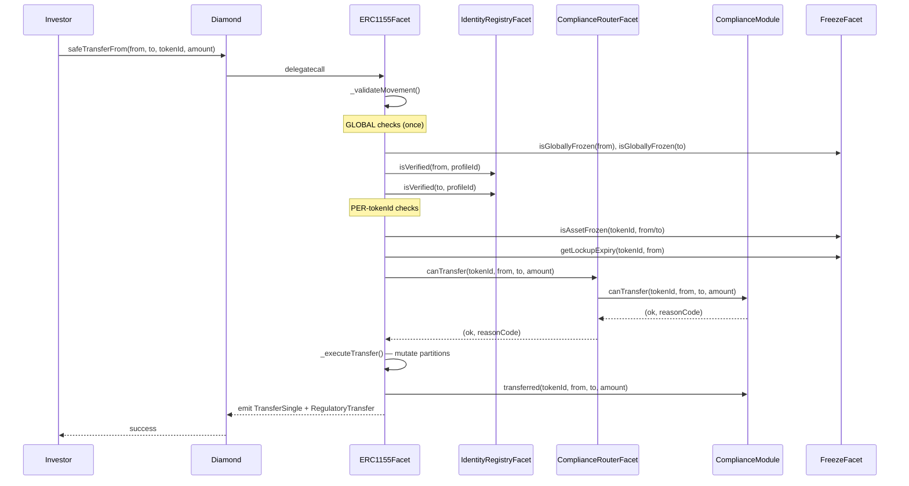

# Architecture: Diamond ERC-3643 Multi-Asset RWA Protocol

## 1. Design Principles

| Principle | Decision |
|-----------|----------|
| Diamond is a shell | No business logic in `Diamond.sol` — only routing |
| Regulatory model per `tokenId` | Each asset carries its own identity profile + compliance module |
| Profile-based identity | Multiple `tokenId`s can share one regulatory profile (reduces deployment cost) |
| Compliance router | Each `tokenId` points to a module; modules are pluggable and upgradeable |
| Storage namespaced | One `LibXxxStorage` per domain — zero collision risk |
| Batch-optimized | Global identity checks done once before per-asset loop |
| Reason codes | Compliance returns `bytes32` codes, not booleans |
| Observability | Rich events for every state change — indexer-friendly |

---

## 2. Three-Level Regulatory Model

```
┌─────────────────────────────────────────────────────────────────┐
│  LEVEL 1 — GLOBAL                                               │
│  (shared across all tokenIds)                                   │
│                                                                 │
│  • Diamond ownership / governance                               │
│  • Global pause                                                 │
│  • Access control roles                                         │
│  • IdentityRegistryStorage  (wallet → ONCHAINID)               │
│  • TrustedIssuersRegistry   (which issuers can attest claims)   │
│  • Emergency facet                                              │
└─────────────────────────────────────────────────────────────────┘
            │
            ▼
┌─────────────────────────────────────────────────────────────────┐
│  LEVEL 2 — PER tokenId (Asset Config)                          │
│                                                                 │
│  • Identity profile ID  →  which claim topics are required      │
│  • Compliance module    →  country rules, max holders, lockup   │
│  • Supply cap / current supply                                  │
│  • Asset-level pause / freeze                                   │
│  • Metadata (name, symbol, URI)                                 │
│  • Authorized issuer (who can mint this asset)                  │
│  • Allowed jurisdictions (country whitelist)                    │
└─────────────────────────────────────────────────────────────────┘
            │
            ▼
┌─────────────────────────────────────────────────────────────────┐
│  LEVEL 3 — PER holder + tokenId                                │
│                                                                 │
│  • Balance                                                      │
│  • Per-asset freeze (binary)                                    │
│  • Partial freeze amount (frozen tokens within balance)         │
│  • Lockup / vesting expiry                                      │
│  • Partition sub-balance (free / locked / custody / pending)    │
└─────────────────────────────────────────────────────────────────┘
```

---

## 3. Facet Map

```
Diamond (proxy shell)
│
├── CORE
│   ├── DiamondCutFacet         — add/replace/remove facets (multisig + timelock)
│   ├── DiamondLoupeFacet       — EIP-2535 introspection + IERC165
│   └── OwnershipFacet          — Ownable2Step
│
├── SECURITY / ADMIN
│   ├── AccessControlFacet      — roles: ISSUER, COMPLIANCE_ADMIN, AGENT,
│   │                             TRANSFER_AGENT, RECOVERY_AGENT, PAUSER, UPGRADER
│   ├── PauseFacet              — global pause + per-tokenId pause
│   └── EmergencyFacet          — circuit breaker outside timelock
│
├── TOKEN
│   ├── ERC1155Facet            — safeTransferFrom, safeBatchTransferFrom,
│   │                             balanceOf, balanceOfBatch, setApprovalForAll
│   │                             (all funnel through _validateMovement)
│   ├── AssetManagerFacet       — registerAsset, setAssetConfig, setComplianceModule
│   ├── SupplyFacet             — mint, mintBatch, burn, burnBatch, forcedTransfer
│   └── MetadataFacet           — uri(), name(), symbol() per tokenId
│
├── IDENTITY
│   ├── IdentityRegistryFacet   — registerIdentity, deleteIdentity, isVerified(wallet, profileId)
│   ├── TrustedIssuerFacet      — addTrustedIssuer, removeTrustedIssuer per profileId
│   └── ClaimTopicsFacet        — setProfileClaimTopics, getProfileClaimTopics
│
├── COMPLIANCE
│   ├── ComplianceRouterFacet   — routes canTransfer() to the module of the tokenId
│   └── ComplianceModulesFacet  — register/unregister compliance modules
│
└── RWA OPERATIONS
    ├── FreezeFacet             — freezeWallet, freezePartial, freezeAsset
    ├── RecoveryFacet           — walletRecovery, forcedBurn, reissue
    ├── CorporateActionsFacet   — redemption, distribution, couponPayment, snapshot
    └── RedemptionFacet         — requestRedemption, executeRedemption, cancelRedemption
```

---

## 4. Storage Layout (Namespaced per Domain)

```solidity
// Each lib uses a unique slot:
// slot = keccak256("diamond.rwa.<domain>.storage") - 1

LibDiamondStorage       // facet routing, owner — slot: EIP-2535 standard
LibAccessStorage        // roles mapping
LibERC1155Storage       // balances, approvals, partitions
LibAssetStorage         // assetConfigs per tokenId
LibIdentityStorage      // wallet→identity, profileClaimTopics, trustedIssuers
LibComplianceStorage    // tokenId→moduleAddress, module registry
LibFreezeStorage        // freeze flags, partial amounts, lockup expiry
LibSupplyStorage        // totalSupply, supplyCap per tokenId
```

### LibAssetStorage layout

```solidity
struct AssetConfig {
    string  name;
    string  symbol;
    string  uri;
    uint256 supplyCap;            // 0 = unlimited
    uint256 totalSupply;
    uint32  identityProfileId;    // → LibIdentityStorage.profiles[id]
    address[] complianceModules;  // → IComplianceModule[] (max 10)
    address issuer;               // who can mint
    bool    paused;
    bool    exists;
    uint16[] allowedCountries;    // ISO 3166-1 numeric
}

struct AssetStorage {
    mapping(uint256 => AssetConfig) configs;   // tokenId → config
    uint256[] registeredTokenIds;
    uint256 nextTokenId;                       // auto-increment
}
```

### LibIdentityStorage layout

```solidity
struct IdentityProfile {
    uint256[] requiredClaimTopics;
    mapping(address => bool) trustedIssuers;
    uint64 version;   // incremented on any change → invalidates cache
}

struct IdentityStorage {
    mapping(address => address)  walletToIdentity;    // wallet → ONCHAINID
    mapping(address => uint16)   walletCountry;
    mapping(address => uint64)   identityVersion;     // per wallet
    mapping(uint32 => IdentityProfile) profiles;      // profileId → policy
    mapping(address => mapping(uint32 => bool)) verifiedCache;   // wallet+profile → status
    mapping(address => mapping(uint32 => uint64)) cacheVersion;  // invalidation
}
```

### LibERC1155Storage layout

```solidity
// Partition enum: values as bitmask
// 0x01 = FREE, 0x02 = LOCKED, 0x04 = CUSTODY, 0x08 = PENDING_SETTLEMENT
struct PartitionBalance {
    uint256 free;
    uint256 locked;
    uint256 custody;
    uint256 pendingSettlement;
}

struct ERC1155Storage {
    // tokenId → holder → partition balances
    mapping(uint256 => mapping(address => PartitionBalance)) partitions;
    // operator approvals
    mapping(address => mapping(address => bool)) operatorApprovals;
}
```

### LibFreezeStorage layout

```solidity
struct FreezeStorage {
    mapping(address => bool)     globalFreeze;           // wallet frozen across all assets
    mapping(uint256 => mapping(address => bool))    assetFreeze;    // tokenId → wallet → frozen
    mapping(uint256 => mapping(address => uint256)) frozenAmount;   // partial freeze
    mapping(uint256 => mapping(address => uint64))  lockupExpiry;   // unix timestamp
}
```

---

## 5. Transfer Validation Flow

```
safeTransferFrom(operator, from, to, tokenId, amount, data)
        │
        ▼
_validateMovement(operator, from, to, [tokenId], [amount], data, TRANSFER)
        │
        ├─ [GLOBAL — once per call]
        │   ├─ 1. !globalPaused
        │   ├─ 2. !globalFreeze[from]
        │   ├─ 3. !globalFreeze[to]
        │   ├─ 4. operator has approval or is from
        │   ├─ 5. identityRegistry.isVerified(from, profileId)  [cached]
        │   └─ 6. identityRegistry.isVerified(to, profileId)    [cached]
        │
        └─ [PER tokenId — in loop for batch]
            ├─ 7.  !assetConfig.paused
            ├─ 8.  !assetFreeze[tokenId][from]
            ├─ 9.  !assetFreeze[tokenId][to]
            ├─ 10. lockupExpiry[tokenId][from] < block.timestamp
            ├─ 11. partitions[tokenId][from].free - frozenAmount >= amount
            ├─ 12. allowedCountries[tokenId].contains(walletCountry[to])
            ├─ 13. for each complianceModules[tokenId]: canTransfer(tokenId, from, to, amount)
            │        └─ returns (bool ok, bytes32 reasonCode) — early exit on first rejection
            │
            ▼
        _executeTransfer()
            ├─ mutate partition balances
            ├─ emit TransferSingle / TransferBatch (ERC-1155)
            └─ emit RegulatoryTransfer(tokenId, from, to, amount, reasonCode)
```

### Batch optimization

```
safeBatchTransferFrom([ids], [amounts])
        │
        ├─ Run steps 1–6 ONCE (global checks)
        └─ Loop over ids:
            └─ Run steps 7–13 per tokenId
```

---

## 6. Compliance Module Interface

```solidity
interface IComplianceModule {
    /// @return ok      true if transfer is allowed
    /// @return reason  bytes32 reason code (0x0 if ok)
    function canTransfer(
        uint256 tokenId,
        address from,
        address to,
        uint256 amount,
        bytes calldata data
    ) external view returns (bool ok, bytes32 reason);

    /// Post-transfer hook (called after balance mutation)
    function transferred(
        uint256 tokenId,
        address from,
        address to,
        uint256 amount
    ) external;

    /// Post-mint hook
    function minted(uint256 tokenId, address to, uint256 amount) external;

    /// Post-burn hook
    function burned(uint256 tokenId, address from, uint256 amount) external;
}
```

### Reason codes (bytes32 constants)

```solidity
bytes32 constant REASON_OK                    = 0x0;
bytes32 constant REASON_INVESTOR_NOT_VERIFIED = keccak256("INVESTOR_NOT_VERIFIED");
bytes32 constant REASON_RECEIVER_NOT_VERIFIED = keccak256("RECEIVER_NOT_VERIFIED");
bytes32 constant REASON_COUNTRY_RESTRICTED    = keccak256("COUNTRY_RESTRICTED");
bytes32 constant REASON_HOLDING_LIMIT         = keccak256("HOLDING_LIMIT_EXCEEDED");
bytes32 constant REASON_LOCKUP_ACTIVE         = keccak256("LOCKUP_ACTIVE");
bytes32 constant REASON_ASSET_PAUSED          = keccak256("ASSET_PAUSED");
bytes32 constant REASON_WALLET_FROZEN         = keccak256("WALLET_FROZEN");
bytes32 constant REASON_SUPPLY_CAP            = keccak256("SUPPLY_CAP_EXCEEDED");
bytes32 constant REASON_TRANSFER_WINDOW       = keccak256("OUTSIDE_TRANSFER_WINDOW");
```

---

## 7. Roles

```
GOVERNANCE_ROLE      — can call diamondCut (must be multisig + timelock)
UPGRADER_ROLE        — can propose facet upgrades
PAUSER_ROLE          — global and per-asset pause/unpause
ISSUER_ROLE          — per-asset: can mint / burn / forcedTransfer
COMPLIANCE_ADMIN     — can register/change compliance modules
TRANSFER_AGENT       — can execute forced transfers
RECOVERY_AGENT       — can execute wallet recovery + reissue
CLAIM_ISSUER_ROLE    — can add trusted issuers to identity profiles
```

---

## 8. Events (Indexer Surface)

```solidity
// ERC-1155 native
event TransferSingle(address indexed operator, address indexed from, address indexed to, uint256 id, uint256 value);
event TransferBatch(address indexed operator, address indexed from, address indexed to, uint256[] ids, uint256[] values);
event ApprovalForAll(address indexed account, address indexed operator, bool approved);
event URI(string value, uint256 indexed id);

// Regulatory
event RegulatoryTransfer(uint256 indexed tokenId, address indexed from, address indexed to, uint256 amount, bytes32 reasonCode);
event AssetRegistered(uint256 indexed tokenId, address indexed issuer, uint32 profileId);
event AssetConfigUpdated(uint256 indexed tokenId);
event ComplianceModuleSet(uint256 indexed tokenId, address indexed module);

// Identity
event IdentityBound(address indexed wallet, address indexed identity, uint16 country);
event IdentityUnbound(address indexed wallet);
event ProfileUpdated(uint32 indexed profileId);
event TrustedIssuerAdded(uint32 indexed profileId, address indexed issuer);
event TrustedIssuerRemoved(uint32 indexed profileId, address indexed issuer);
event VerificationCacheInvalidated(address indexed wallet, uint32 indexed profileId);

// Freeze / Recovery
event WalletFrozen(address indexed wallet, bool frozen);
event AssetFrozen(uint256 indexed tokenId, address indexed wallet, bool frozen);
event PartialFreeze(uint256 indexed tokenId, address indexed wallet, uint256 amount);
event LockupSet(uint256 indexed tokenId, address indexed wallet, uint64 expiry);
event WalletRecovered(address indexed lostWallet, address indexed newWallet, address indexed identity);
event ForcedTransferExecuted(uint256 indexed tokenId, address indexed from, address indexed to, uint256 amount);

// Supply
event Minted(uint256 indexed tokenId, address indexed to, uint256 amount);
event Burned(uint256 indexed tokenId, address indexed from, uint256 amount);

// Governance
event FacetUpgradeProposed(address indexed facet, bytes4[] selectors, uint256 timelockUntil);
event EmergencyPause(address indexed triggeredBy);
```

---

## 9. Compliance Modules (pluggable)

| Module | Description |
|--------|-------------|
| `CountryRestrictModule` | Whitelist/blacklist of ISO country codes per tokenId |
| `MaxHoldersModule` | Cap on number of unique holders per tokenId |
| `HoldingCapModule` | Max % or absolute amount any single holder can hold |
| `LockupModule` | Time-based transfer window; blocks transfers before expiry |
| `TransferWindowModule` | Allowed time windows (e.g. market hours) |
| `InvestorCategoryModule` | Restrict to accredited/professional investors |
| `JurisdictionPairModule` | Rules per (from-country, to-country) pair |
| `IssuanceOnlyModule` | Only issuer↔investor; no peer-to-peer transfers |
| `SettlementModule` | DVP: transfer only when settlement proof is provided |
| `TrancheModule` | Tranche seniority rules between token classes |

---

## 10. Sequence Diagram — Full Transfer



---

## 11. Implementation Order (Feature Branches)

```
v0.1.0  ✅  feat/diamond-core        — Diamond proxy, LibDiamond, LibAppStorage, core facets
v0.2.0      feat/storage-namespacing  — Split AppStorage into LibXxxStorage per domain
v0.3.0      feat/access-control       — AccessControlFacet, roles, PauseFacet, EmergencyFacet
v0.4.0      feat/asset-manager        — AssetManagerFacet, AssetConfig, registerAsset
v0.5.0      feat/identity-layer       — IdentityRegistryFacet, TrustedIssuerFacet, ClaimTopicsFacet, profile cache
v0.6.0      feat/compliance-router    — IComplianceModule, ComplianceRouterFacet, reason codes
v0.7.0      feat/erc1155-core         — ERC1155Facet with _validateMovement, partition balances
v0.8.0      feat/supply               — SupplyFacet: mint/burn/forcedTransfer
v0.9.0      feat/freeze               — FreezeFacet: global/asset/partial freeze, lockup
v0.10.0     feat/compliance-modules   — CountryRestrict, MaxHolders, HoldingCap, Lockup modules
v0.11.0     feat/metadata             — MetadataFacet, uri() per tokenId
v0.12.0     feat/recovery             — RecoveryFacet: wallet recovery, reissue
v0.13.0     feat/corporate-actions    — CorporateActionsFacet: redemption, distribution, snapshot
v1.0.0      feat/deploy-scripts       — Deploy script, Anvil integration tests, audit prep
```

---

## 12. What to Avoid

| Anti-pattern | Why | Solution |
|---|---|---|
| Single compliance for all tokenIds | Breaks regulatory segregation | Compliance router per tokenId |
| Global `require` checks inside batch loop | Gas explosion | Hoist global checks before loop |
| Claim validation on every transfer | Too expensive | Cache with version invalidation |
| Giant `AppStorage` mixing all domains | Storage collision risk on upgrade | Namespaced libs per domain |
| Binary freeze (frozen/not) | Too coarse for RWA | Partition sub-balances |
| `false` returns from compliance | No debuggability | `(bool, bytes32)` reason codes |
| Loops over holder lists | DoS risk | Snapshot / indexer pattern |
| Arrays for per-asset trusted issuers | Iteration gas | `mapping(address => bool)` |
| `string` reason codes | Gas waste | `bytes32` constants |
