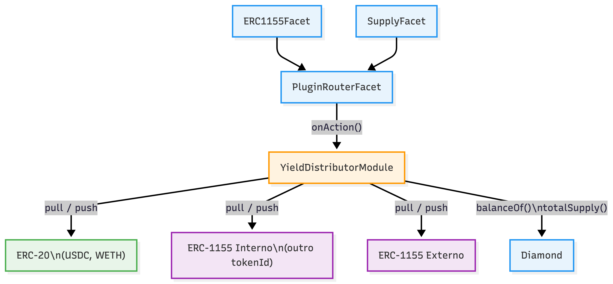
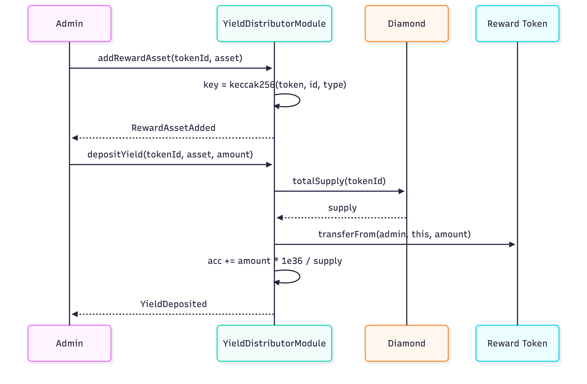
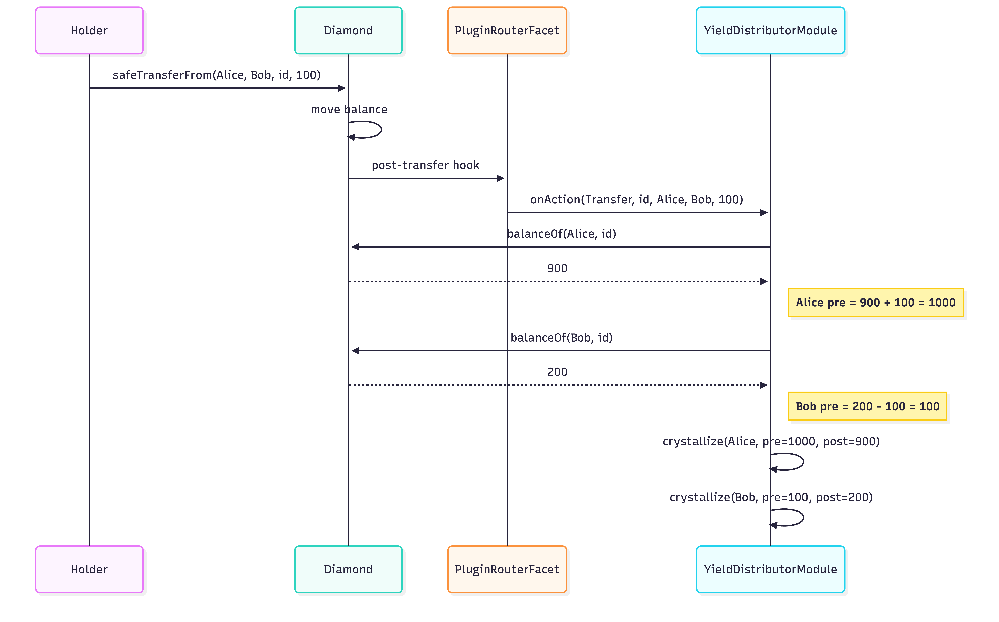
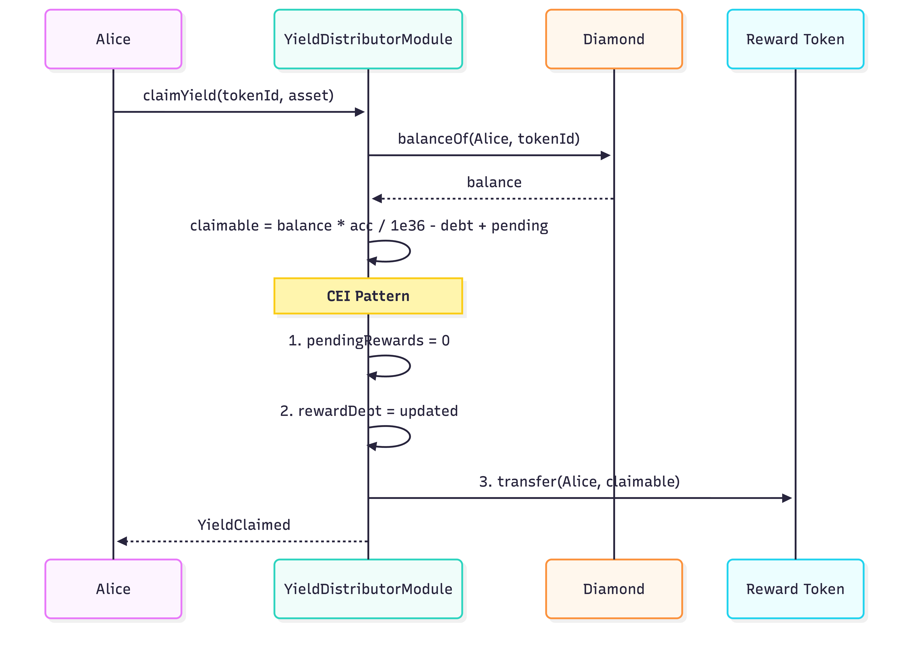
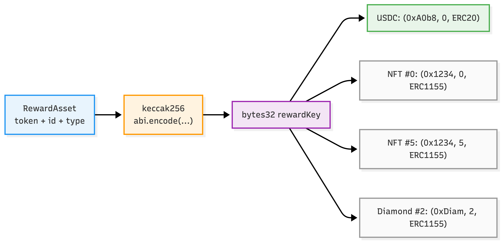

# YieldDistributorModule

Distribuicao proporcional de rendimentos (yield) para holders de security tokens RWA, usando o padrao acumulador **Synthetix/MasterChef** com complexidade **O(1)** por operacao.

---

## Tipos de Recompensa Suportados

| Tipo | Exemplo | Uso |
|------|---------|-----|
| **ERC-20** | USDC, WETH, WBTC | Dividendos em stablecoins ou tokens externos |
| **ERC-1155 (mesmo Diamond)** | Outro `tokenId` do protocolo | Holder de tokenId 1 recebe % de tokenId 2 |
| **ERC-1155 (externo)** | Qualquer contrato ERC-1155 | Recompensas em NFTs fracionados, game items, etc. |

Cada `tokenId` (classe de ativo staked) pode ter ate **5 reward assets** simultaneos, de qualquer combinacao dos tipos acima.

---

## Diagramas

### Arquitetura Geral



### Fluxo de Deposito



### Hooks (Transfer / Mint / Burn)



### Fluxo de Claim




### Reward Key



---

## Exemplos Praticos

### Exemplo 1: Fundo Imobiliario paga dividendos em USDC

Uma empresa tokenizou um predio comercial como **tokenId 1**. Cada token representa uma fracao do imovel. Mensalmente, o aluguel arrecadado e distribuido como dividendos em USDC.

**Cenario:**
- tokenId 1 = "Edificio Centro SP" — totalSupply = 100,000 tokens
- Alice comprou 30,000 tokens (30%)
- Bob comprou 50,000 tokens (50%)
- Carol comprou 20,000 tokens (20%)
- Aluguel do mes: 10,000 USDC

**Passo a passo:**

```
1. Admin registra USDC como reward do tokenId 1:
   addRewardAsset(1, {token: USDC, id: 0, assetType: ERC20})

2. Admin deposita o aluguel do mes:
   USDC.approve(yieldModule, 10_000e6)
   depositYield(1, {token: USDC, id: 0, assetType: ERC20}, 10_000e6)

   → accRewardPerShare += 10_000e6 * 1e36 / 100_000 = 1e35

3. Alice faz claim:
   claimYield(1, {token: USDC, id: 0, assetType: ERC20})
   → recebe 30_000 * 1e35 / 1e36 = 3,000 USDC (30%)

4. Bob faz claim:
   → recebe 5,000 USDC (50%)

5. Carol faz claim:
   → recebe 2,000 USDC (20%)
```

### Exemplo 2: Holder de um ativo recebe tokens de outro ativo do protocolo

A empresa lanca um segundo ativo **tokenId 2** = "Bonus Fidelidade". Holders do tokenId 1 recebem tokens do tokenId 2 como incentivo — tudo dentro do mesmo Diamond.

**Cenario:**
- tokenId 1 = "Edificio Centro SP" — totalSupply = 100,000
- tokenId 2 = "Bonus Fidelidade" — tokens mintados pelo admin
- Distribuicao: 500 tokens de tokenId 2 para holders de tokenId 1

```
1. Admin registra o tokenId 2 do Diamond como reward do tokenId 1:
   addRewardAsset(1, {token: DIAMOND_ADDRESS, id: 2, assetType: ERC1155})

2. Admin minta 500 tokens de tokenId 2 para si mesmo, e aprova o modulo:
   Diamond.mint(2, admin, 500)
   Diamond.setApprovalForAll(yieldModule, true)

3. Admin deposita:
   depositYield(1, {token: DIAMOND_ADDRESS, id: 2, assetType: ERC1155}, 500)

4. Alice (30% do tokenId 1) faz claim:
   claimYield(1, {token: DIAMOND_ADDRESS, id: 2, assetType: ERC1155})
   → recebe 150 tokens de tokenId 2

5. Bob (50%) → recebe 250 tokens de tokenId 2
6. Carol (20%) → recebe 100 tokens de tokenId 2
```

### Exemplo 3: Recompensa em ERC-1155 externo (game items, carbon credits, etc.)

Um projeto externo de carbon credits emite creditos como ERC-1155. Holders do tokenId 1 recebem carbon credits proporcionalmente.

**Cenario:**
- tokenId 1 = "Edificio Centro SP" — totalSupply = 100,000
- CarbonCredit (contrato externo ERC-1155), tokenId 42 = "2024 Q4 Credits"
- Distribuicao: 1,000 carbon credits

```
1. Admin registra o carbon credit externo como reward:
   addRewardAsset(1, {token: CARBON_CONTRACT, id: 42, assetType: ERC1155})

2. Admin aprova o modulo no contrato externo:
   CarbonCredit.setApprovalForAll(yieldModule, true)

3. Admin deposita:
   depositYield(1, {token: CARBON_CONTRACT, id: 42, assetType: ERC1155}, 1000)

4. Holders fazem claim normalmente:
   Alice → 300 carbon credits (30%)
   Bob   → 500 carbon credits (50%)
   Carol → 200 carbon credits (20%)
```

### Exemplo 4: Multiplos rewards simultaneos + transferencia no meio

O mesmo tokenId pode ter ate 5 rewards simultaneos. E se um holder transfere tokens entre depositos, o acumulador ajusta automaticamente.

**Cenario:**
- tokenId 1 com 3 rewards: USDC + WETH + Carbon Credits
- Alice tem 60,000 tokens, Bob tem 40,000 tokens

```
1. Admin deposita 10,000 USDC:
   → Alice acumula 6,000 USDC, Bob acumula 4,000 USDC

2. Alice transfere 20,000 tokens para Bob:
   → Hook crystallize: salva os rewards pendentes de ambos
   → Alice agora tem 40,000 tokens, Bob tem 60,000 tokens

3. Admin deposita 5,000 USDC:
   → Alice acumula mais 2,000 USDC (40%), Bob acumula mais 3,000 USDC (60%)

4. Alice faz claimAllYield(1):
   → Recebe 8,000 USDC (6,000 do primeiro + 2,000 do segundo)
   → Recebe WETH proporcional (se houve deposito)
   → Recebe Carbon Credits proporcional (se houve deposito)
   → Tudo em uma unica transacao
```

---

## Hooks — Reconstrucao de Balance Pre-Mutacao

Os hooks executam **APOS** a mutacao de balance no Diamond. O modulo reconstroi o balance pre-mutacao:

| Evento | `from` pre-balance | `to` pre-balance |
|--------|-------------------|------------------|
| Transfer | `currentBalance + amount` | `currentBalance - amount` |
| Mint | — | `currentBalance - amount` |
| Burn | `currentBalance + amount` | — |

Isso garante que o acumulador calcule corretamente os rewards devidos ate o momento da mutacao.

---

## Reward Key

Cada reward asset e identificado por um `bytes32 rewardKey`:

```solidity
rewardKey = keccak256(abi.encode(token, id, assetType))
```

Isso resolve a ambiguidade de `id == 0` para ERC-20 vs ERC-1155 tokenId 0 (que e valido pelo standard):

| Asset | token | id | assetType | Key |
|-------|-------|----|-----------|-----|
| USDC | 0xA0b8...eB48 | 0 | ERC20 | `keccak256(USDC, 0, 0)` |
| NFT tokenId 0 | 0x1234...5678 | 0 | ERC1155 | `keccak256(NFT, 0, 1)` |
| NFT tokenId 5 | 0x1234...5678 | 5 | ERC1155 | `keccak256(NFT, 5, 1)` |
| Diamond tokenId 2 | 0xDiamond | 2 | ERC1155 | `keccak256(Diamond, 2, 1)` |

Usa `abi.encode` (nao `encodePacked`) para evitar colisoes de hash.

---

## RewardAsset Struct

```solidity
enum RewardType { ERC20, ERC1155 }

struct RewardAsset {
    address token;      // endereco do contrato ERC-20 ou ERC-1155
    uint256 id;         // 0 para ERC-20; tokenId para ERC-1155
    RewardType assetType;
}
```

---

## API

### Admin

| Funcao | Descricao |
|--------|-----------|
| `addRewardAsset(tokenId, asset)` | Registra um reward asset (max 5 por tokenId) |
| `removeRewardAsset(tokenId, asset)` | Remove um reward asset |
| `depositYield(tokenId, asset, amount)` | Deposita yield para distribuicao proporcional |

### Holder

| Funcao | Descricao |
|--------|-----------|
| `claimYield(tokenId, asset)` | Resgata yield de um reward asset especifico |
| `claimAllYield(tokenId)` | Resgata yield de todos os reward assets do tokenId |

### Views

| Funcao | Descricao |
|--------|-----------|
| `claimableYield(tokenId, asset, holder)` | Yield disponivel para claim |
| `getRewardAssets(tokenId)` | Lista reward assets registrados |
| `rewardKey(asset)` | Retorna o bytes32 key de um asset |
| `accRewardPerShare(tokenId, key)` | Acumulador atual |
| `rewardDebt(tokenId, key, user)` | Debt do usuario |
| `pendingRewards(tokenId, key, user)` | Rewards cristalizados |

---

## Seguranca

### ReentrancyGuard

`depositYield`, `claimYield` e `claimAllYield` sao `nonReentrant`. Necessario porque:
- ERC-1155 `safeTransferFrom` chama `onERC1155Received` no receiver, criando superficie de reentrada
- ERC-20 nao-standard (ex: tokens com hooks) tambem podem triggerar callbacks

### CEI Pattern (Checks-Effects-Interactions)

Em `claimYield`:
1. **Check**: calcula `claimable`, verifica > 0
2. **Effect**: zera `pendingRewards`, atualiza `rewardDebt`
3. **Interaction**: `_pushReward` transfere tokens

### IERC1155Receiver

O modulo implementa `IERC1155Receiver` para poder receber tokens ERC-1155 via `safeTransferFrom`.

### Controle de Acesso

- `owner`: admin que pode addRewardAsset, removeRewardAsset, depositYield
- `DIAMOND`: unico endereco que pode chamar `onAction` (hooks)
- Holders: qualquer um pode fazer claim dos seus proprios rewards

### Limites

- Max 5 reward assets por tokenId (`MAX_REWARD_ASSETS`)
- ERC-20 com `id != 0` e rejeitado (`InvalidERC20Id`)
- Deposito com `totalSupply == 0` e rejeitado (divisao por zero)

---

## Testes

58 testes cobrindo:

- **ERC-20**: USDC (6 dec), WETH (18 dec), WBTC (8 dec), tokens nao-standard
- **ERC-1155 externo**: deposito, claim, proporcionalidade entre holders
- **ERC-1155 tokenId 0**: caso edge validado
- **Mixed**: `claimAllYield` com USDC + WETH + ERC-1155 externo simultaneo
- **Hooks**: transfer, mint, burn, forcedTransfer — cristalizacao correta
- **Cenarios complexos**: mint dilution, burn then claim, deposit-transfer-deposit
- **Fuzz**: `ClaimNeverExceedsDeposit`, `ProportionalDistribution`, `TransferPreservesTotalClaimable`
- **Precisao**: small deposits, small holders em large supply
- **Reverts**: owner checks, diamond checks, zero amount, zero supply, duplicates, max assets

```bash
forge test --match-path 'test/unit/modules/plugins/YieldDistributorModule.t.sol' -vvv
```
